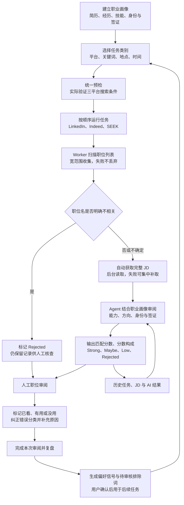

# Job Agent

当前稳定版本：`v1.0.0`。LinkedIn、Indeed 和 SEEK Worker 使用相同版本号。

## 项目简介

Job Agent 是一个在本机运行、以**广覆盖和避免遗漏**为优先目标的求职检索与审阅工具。它适合使用较宽泛的关键词搜索 LinkedIn、Indeed 和 SEEK，尽可能收集完整结果，再通过职业画像、职位名初筛、完整 JD 和 AI 匹配逐层缩小审阅范围。与只展示少量推荐结果的求职 Agent 相比，本项目更重视结果覆盖率和可追溯性，当前核心原则是：**宁可保留重复，也不要因为过早去重或判断失败而漏掉职位机会。**

三个平台都由 Tampermonkey Worker 在用户已经登录的真实浏览器页面中完成搜索与读取，而不是由服务器直接批量请求招聘网站。这样可以沿用正常浏览器访问路径，降低后台抓取触发访问限制的风险，也允许用户在登录、验证码或页面变化时及时介入。系统同时提供访问节流、任务串行、失败保留、JD 补取、历史结果复用和人工确认等多层保护。

Agent 不会自动投递职位，也不会尝试绕过登录、验证码或平台安全检查。遇到需要人工处理的页面时，任务会暂停并等待用户继续。

## 当前工作流



每次任务都形成独立运行批次，可以在“职位审阅”继续处理未看职位，也可以按任务和执行时间回到历史记录。三个平台的结果会进入同一套审阅流程，但平台原始 ID、链接、运行批次和处理状态都会保留，方便追溯和重新获取。

随着使用次数增加，人工反馈会逐步形成更准确的偏好模型；经用户批准的排除关键词会减少明显无关职位，职位名初筛会减少不必要的完整 JD 获取，历史 AI 结果也会被复用。因此，系统的目标是让后续筛选更符合用户需求，并在同等搜索范围下逐步减少不必要的 AI 调用和 token 消耗。

## 最快打开方式

需要先安装 [Node.js](https://nodejs.org/) 18 或更高版本。

在 PowerShell 中运行：

```powershell
cd C:\path\to\job_agent
npm start
```

看到下面的信息后，保持这个 PowerShell 窗口打开：

```text
Job Agent is running at http://127.0.0.1:4317
```

然后在浏览器打开：

<http://127.0.0.1:4317>

日常再次使用时，只需要进入项目目录运行 `npm start`，再打开上面的地址。关闭运行 `npm start` 的终端或按 `Ctrl+C` 即可停止服务。

## 首次安装

```powershell
git clone https://github.com/Young501/job_agent.git
cd job_agent
npm start
```

这个项目目前没有第三方 Node.js 依赖，因此不需要额外执行 `npm install`。

启动面板后：

1. 在 Chrome 中安装 Tampermonkey。
2. 打开 Job Agent 左侧的“安装设置”。
3. 点击一键安装，或分别安装 LinkedIn、Indeed、SEEK Worker。
4. 在 Tampermonkey 安装页面确认安装。已有同一 Worker 的旧版本会被覆盖。
5. 保持三个平台处于登录状态。

Worker 只有在 Job Agent 发出预检或运行任务时才会自动操作网页。平时正常浏览招聘网站不会开始扫描。

从 `2.x` 开发版本切换到稳定版 `v1.0.0` 时，Tampermonkey 可能提示版本号降低；这是本次稳定版编号统一，手动确认覆盖即可，Worker 历史不会因此清空。

## PDF 简历

`.txt`、`.md` 和 `.docx` 可以直接读取。读取文字型 PDF 还需要 Python 3 和 `pypdf`：

```powershell
python -m pip install pypdf
```

如果系统中的 Python 命令不是 `python`，可以在 `.env` 中指定：

```dotenv
JOB_AGENT_PYTHON_PATH=C:\path\to\python.exe
```

扫描版 PDF 没有可提取文字时，可将简历内容粘贴到文本框，或使用职业画像页面提供的 GPT Prompt，在 ChatGPT 中生成画像 JSON 后粘贴回来。

## 配置 AI

AI 是可选的。不配置时，职位名筛选、基础 JD 筛选和复盘仍可使用本地规则运行。

推荐直接在“搜索设置 -> AI 服务”中填写：

- Base URL：OpenAI 兼容接口的地址，通常以 `/v1` 结尾。
- Model：接口支持的模型名称。
- API Key：对应接口的密钥。
- API 格式：根据服务选择 Responses API 或 Chat Completions。

先点击“测试连接”，成功后再点击“保存 AI 配置”。API Key 只保存在本机的 `data/ai-config.json`，不会回显到页面，也不会提交到 Git。

也可以复制 `.env.example` 为 `.env` 后通过环境变量配置。默认已限制输入长度、输出 token 和单次运行调用次数。

## 每日使用流程

1. 在“职业画像”上传或粘贴简历，系统会尝试填入基本信息、身份与签证、工作、项目、教育、课外活动、证书、语言、技能和荣誉。所有字段均可留空；可逐条补充经历、创建自定义板块，确认后整份结构化画像会用于职位匹配。身份与签证板块还可填写需要 AI 额外强制保留的身份或签证要求。
2. 在“每日任务”选择预设类别导入队列，或创建自定义类别。
   需要多个备选关键词时使用逗号分隔，例如 `intern, internship`。平台搜索第一个词，Worker 会按任一备选词保留职位；不要填写布尔表达式 `OR`。
3. 对尚未验证的任务执行统一预检。浏览器会实际填写平台、关键词、地点和时间条件。
4. 预检成功后点击“开始运行”。三个平台严格按顺序执行，不会并行操作同一浏览器。
5. 每个 Worker 先扫描职位卡片。标题已明确不符合的职位直接保留为 `REJECTED`；其余职位会自动、逐条获取完整 JD，再提交给本地 Agent 排队进行 AI 审阅。AI 会把岗位能力匹配与身份/签证兼容性分开判断，并按完整语义理解多个可选条件；明确不兼容才排除，信息模糊或命中用户强制保留范围时继续保留。相同平台职位已有 AI 结果时会复用历史结果，减少网页访问和 token。
6. 登录、验证码或页面异常需要人工处理时，根据运行监控中的提示处理并继续。单条 JD 获取失败不会丢掉该职位，审阅页会明确标注失败状态。
7. 在“职位审阅”查看本次任务统计、自动 AI 评分和处理状态。分数下方的虚线表示可悬浮查看一句评分理由。刷新图标会使用已保存的完整 JD 重新执行 AI 审阅；旧职位缺少 JD 时，文件搜索图标会打开原职位，由对应 Worker 读取完整 JD 后自动继续审阅，不再要求手动粘贴。
   已结束的单项任务统计可以连同其关联职位删除；“运行历史”可以删除整次运行及其关联职位，两者都不会影响每日任务或任务类别。
8. 对已经完成 AI JD 审阅、但判断没有帮助的职位点击“没帮助”，可选“分类错了”或“与我无关”，也可以补充原因。
9. 当日审阅结束后点击“完成本次审阅并复盘”。学习结果会影响后续排序和筛选，但不会删除任何职位。

历史职位和复盘结论保存在“历史记录”中。撤销旧反馈后，可以选择对应历史批次重新复盘，以清除已经不适用的偏好。

## 数据与安全

以下内容只保存在本机并已被 `.gitignore` 排除：

- `data/state.json`：任务、职位、画像和复盘记录。
- `data/ai-config.json`：AI 服务配置和 API Key。
- `data/uploads/`：临时上传文件。
- `.env`：本机环境变量。

“安装设置”中提供调试用的一键清除功能，会在二次确认后清除 Agent 记录和三个 Worker 的历史。内置预设、自定义任务类别、职业画像、搜索设置和 AI Key 都会保留。

## 测试

```powershell
npm test
```

详细功能范围和设计边界见 [PHASE1_SCOPE.md](./PHASE1_SCOPE.md)。

## 常见问题

### 页面打不开

确认运行 `npm start` 的终端仍然打开，并访问 `http://127.0.0.1:4317`。如果端口被占用，先关闭旧的 Node.js/Job Agent 服务再重试。

### 任务一直等待 Worker

确认 Tampermonkey 已启用对应平台的 Job Agent Worker，并刷新平台页面。也可以在“安装设置”重新安装最新版 Worker。

### 预检打开页面后没有继续

检查平台是否已登录、是否出现验证码，以及 Worker 是否启用。处理页面提示后，在每日任务中重新尝试预检。

### AI 不可用

先在“搜索设置”执行连接测试。AI 调用失败时系统会保留职位，并在可以回退的流程中使用本地规则，不会因为一次 AI 错误丢失职位。
